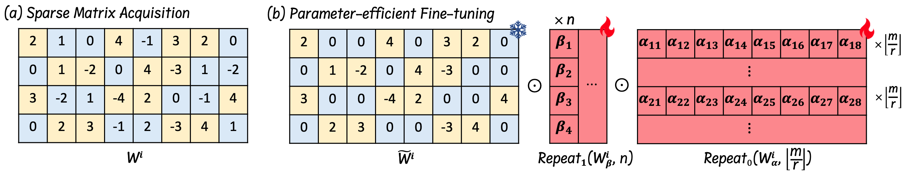

# SPP: Sparsity-Preserved Parameter-Efficient Fine-Tuning for Large Language Models

Pytorch implementation of the SPP methods as presented in:

**SPP: Sparsity-Preserved Parameter-Efficient Fine-Tuning for Large Language Models (ICML 2024)**</br>

*Xudong Lu\*, Aojun Zhou\*, Yuhui Xu\*, Renrui Zhang, Peng Gao, Hongsheng Li* (\* indicates equal contribution)</br>
[paper](https://arxiv.org/abs/2405.16057)



## Installation
Step 1: Our code is implemented based on [alpaca-lora](https://github.com/tloen/alpaca-lora/tree/8bb8579e403dc78e37fe81ffbb253c413007323f), setup the environment based on the instructions in the repository. To be specific, we use `torch 2.1.0` with `transformers 4.28.0`.

Step 2: Clone this repository and install the requirements:
```bash
cd peft
pip install -e .
```
This will install our modified PEFT code. Our code is based on `PEFT 0.2.0`.

## Dataset
We use the [Alpaca](https://crfm.stanford.edu/2023/03/13/alpaca.html) dataset. Alpaca and Alpaca-GPT4 have been provided in this repository.

## Train
We present a Memory Usage Optimization method in the paper and compare it with the direct use of `torch.repeat_interleave()` function, finding it will lead to memory reduction for the 7B model. However, when compared with gradient checkpointing or further combined with deepspeed, we notice it may not always confer a training advantage. We include our training scripts for both the 7B and 30B models, which are compatible with 8 A100-80G GPUs.

### Training LLaMA 7B model
We provide the instructions of using gradient checkpointing.

Step 1: Running
```
torchrun --nproc_per_node=8 --master_port=20009  finetune.py \
    --base_model '/path/to/wanda-llama-7b-2:4' \
    --data_path './alpaca_data_gpt4.json' \
    --output_dir '/path/to/output/wanda-7b-2:4-spp' \
    --batch_size 128 \
    --cutoff_len 512\
    --micro_batch_size 8 \
    --num_epochs 3
```
Step 2: Then you will get the trained model in `/path/to/output/wanda-7b-2:4-spp`, with 
```
.
├── adapter_config.json
├── adapter_model.bin
├── checkpoint-1000
├── checkpoint-200
├── checkpoint-400
├── checkpoint-600
├── checkpoint-800
└── completed
```
Step 3: Merge the adapters with original model using `export_hf_checkpoint.py`.
In this file, replace `BASE_MODEL` with your `/path/to/wanda-llama-7b-2:4` and `ckpt_path` with `/path/to/output/wanda-7b-2:4-spp`. Then run the script. You will get the merged model in `./output_models/wanda-7b-2:4-spp`.

### Training LLaMA 30B model using deepspeed
We provide the instructions of using our memory optimization method.

Step 1: Replace the original [lora.py](peft/src/peft/tuners/lora.py) in the PEFT repo with this [lora.py](asserts/lora.py).

Step 2: Running
```
torchrun --nnodes 1 --nproc_per_node 8 --master_port=20009  finetune_deepspeed.py \
    --base_model '/path/to/wanda-llama-30b-2:4' \
    --data_path './alpaca_data_gpt4.json' \
    --output_dir '/path/to/output/wanda-30b-2:4-spp' \
    --batch_size 256 \
    --cutoff_len 512\
    --micro_batch_size 16 \
    --num_epochs 3
```
Step 3: Then you will get the trained model in `/path/to/output/wanda-30b-2:4-spp`, with 
```
.
├── checkpoint-400
├── checkpoint-500
└── checkpoint-final
```
Step 3: This training script save the whole model during training. You should extract the adapters by `convert_ckpt.py`. Replace the `model_name` and `dir` in the script with your model path. Then run the script. You will get the extracted adapters in `/path/to/output/wanda-30b-2:4-spp/wanda-30b-2:4-spp`.

Step 4: Merge the adapters with original model as the same as Step 3 of the LLaMA 7B model.

## Evaluation
The evaluation is based on [Wanda](https://github.com/locuslab/wanda/tree/8e8fc87b4a2f9955baa7e76e64d5fce7fa8724a6), which provides a modified version of EleutherAI LM Harness framework. You can test with the trained model with this framework.

## Questions

Feel free to discuss papers/code with us through issues/emails!

- Xudong Lu: <a href="luxudong@link.cuhk.edu.hk">luxudong@link.cuhk.edu.hk</a> 

## Citation

If you find our paper and code useful in your research, please cite

```
@misc{lu2024spp,
      title={SPP: Sparsity-Preserved Parameter-Efficient Fine-Tuning for Large Language Models}, 
      author={Xudong Lu and Aojun Zhou and Yuhui Xu and Renrui Zhang and Peng Gao and Hongsheng Li},
      year={2024},
      eprint={2405.16057},
      archivePrefix={arXiv},
      primaryClass={cs.CL}
}
```